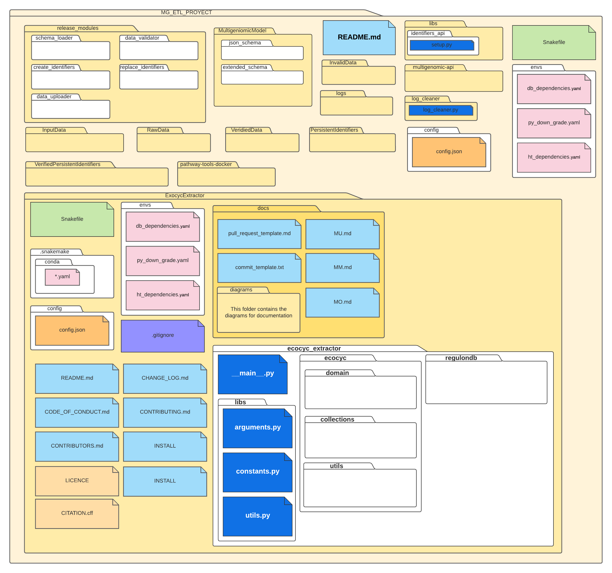

# Maintenance Manual Ecocyc Extractor

## Introduction

This document describes the current status of the Ecocyc Extractor system. The objective is show and describe the internal structure of each of the components that make it up.

## System internal structure

The folder structure shown in the template in Figure 1, is made up of a directory where is the EcocycExtractor data extraction program, written in _Python_, is called **ecocyc_extractor**, a directory configuration file for general data of the database and collections called **config**, a directory of configuration files for execution environments **envs**, a folder with the validation and data loading programs provided by the RegulonDB team **release_modules**, a directory **schemas** that contains the necessary schemas for data validation, and directories for input, output, valid, invalid, and id replaced files and log files will be put.

<a href="https://lucid.app/lucidchart/6d286395-1a4d-4874-a1a9-82e6e01475ed/edit?page=0_0&invitationId=inv_d6ebc6b4-c169-49eb-bcb0-e7b9262e5623#">
</img>
</a>
Figure 1. System folder organization

## Plugins and compatibility with other systems

Due to the nature of the _Snakemake_ system, there are no compatibility problems cause the necessary software for the the programs are installed locally in isolated environments, you only need to have _Python3.10_ or higher to be able to install the _Snakemake_ system.

## Operation restrictions

In the _Windows_ operating system, the _Snakemake_ system usually gives problems to be installed and create execution environments, so it is recommended to use a _Linux/Unix_ system or the Windows Subsystem for Linux (WSL) that allows us to use the Terminal and Bash of _Linux_ from _Windows 10_ or install _Linux_ on a virtual machine. This is how we can use the Snakemake system to run and test the program.

## Suggestions for improvement

Our recommendations are add a directory for local libraries in the root directory, since it has to be accessed from the path **.Snakemake/conda/\*.Yaml** which makes searching for a local library more confusing, at the moment this directory is in the path **release_modules/apis/**

## Definitions, acronyms and abbreviations

- **[Snakemake](https://snakemake.readthedocs.io/en/stable/)** - The Snakemake workflow management system is a tool to create reproducible and scalable data analyses. Workflows are described via a human readable, Python based language.
- **[PythonCyc]( https://github.com/regulondbunam/PythonCyc)** -The PythonCyc module provides a Python 3.5+ interface to a Pathway Tools application running either locally or remotely. This module has been designed to work on the three platforms supported by Pathway Tools: Linux, Mac OS X, and Windows. Pathway Tools version 18.5 or above is needed to use this module.

## Help and Support

If you have a problem or suggestion of any kind related to what is described in this manual, you can send an email to: [regusoft@ccg.unam.mx](mailto:regusoft@ccg.unam.mx)

The documents mentioned as reference in this manual may be requested through the aforementioned address.

## Bibliographic references

**Websites**

- Website title: Snakemake
  - Web link: [https://snakemake.readthedocs.io/en/stable/](https://snakemake.readthedocs.io/en/stable/)

- Website title: PythonCyc
  - Web link: [https://bioinformatics.ai.sri.com/ptools/pythoncyc](https://bioinformatics.ai.sri.com/ptools/pythoncyc.html)

- Website title: PathwayTools
  - Web link: [https://bioinformatics.ai.sri.com/ptools/](https://bioinformatics.ai.sri.com/ptools/)
